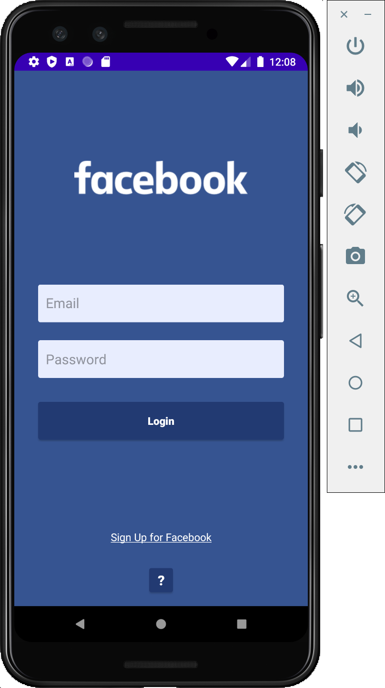
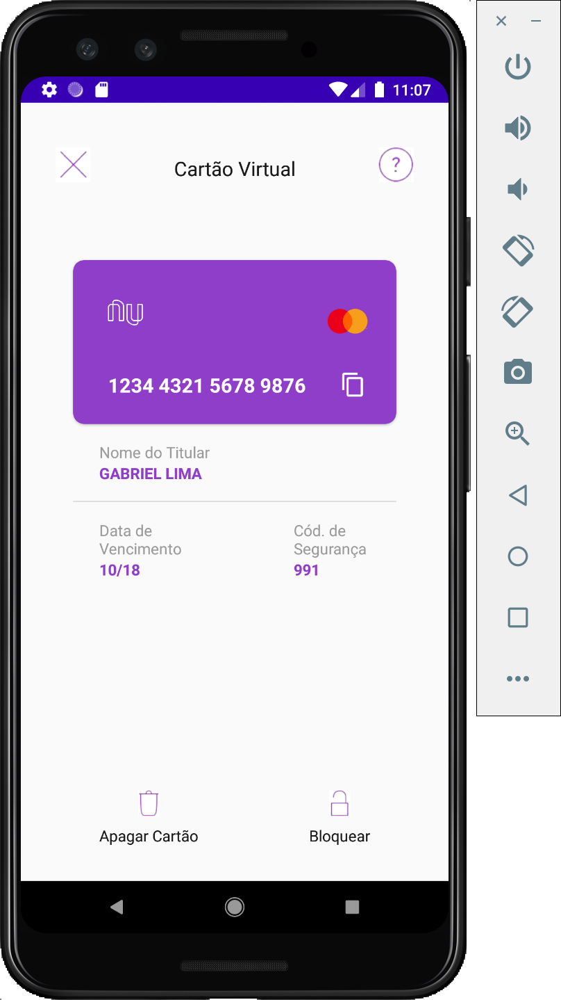

# layoutFacebookNubank
Desafio para criar o layout do Facebook e Nubank usando Android + Kotlin.

Curso de Desenvolvimento de Aplicativos Android Studio - Kotlin (Cellep - Estação Hack)

### DESAFIO

Tentem replicar no Android Studio em um novo projeto estas duas telas: 
* Facebook 
* Nubank Podem colocar imagens diferentes destas! Não tem problema! 

### MINHA RESOLUÇÃO

#### Facebook 

#### Nubank 

